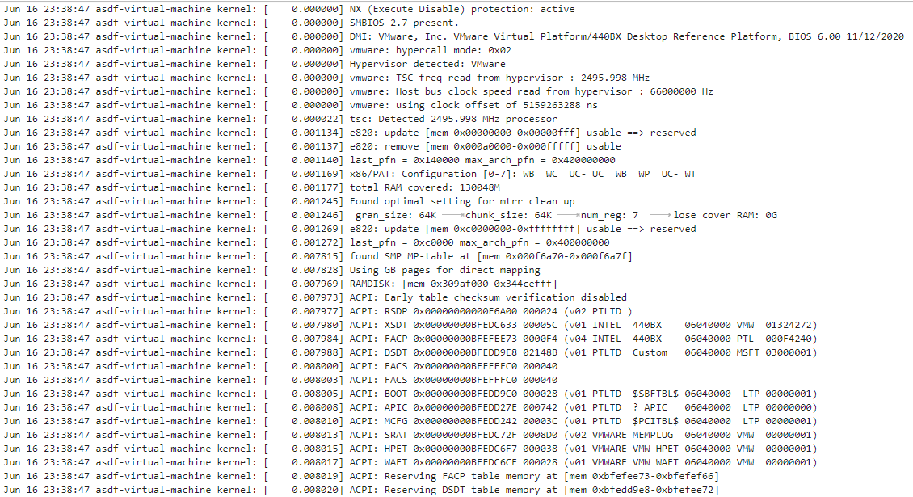
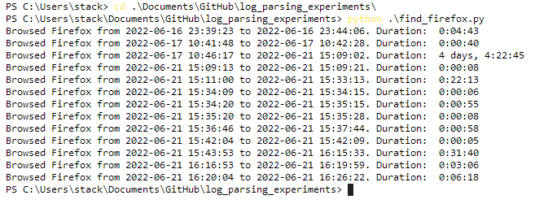

## Introduction

In this project we use the outcomes of our research into log summarization to extract user activity related to firefox from a syslog file.

## Setup 

Ensure that you have a working python installation, preferably 3.6+

The syslog file to be used must be named just "syslog" and placed in the "logfiles" directory. For testing purposes, a sample syslog file from the data collected by me has been provided.

Examining the file using any text editor of your choice will reveal that it is a verbose and jumbled mess, and it is almost impossible to infer anything from the raw data.



## Prerequisites

The following packages must be installed (they can be installed with pip):

- numpy
- scipy
- pandas
- torch
- scikit-learn
- pyparsing

## Steps

Once you have placed your syslog file in the "logfiles" directory, we can move ahead with the analysis.

For this demonstration, we will use our parser to extract information about firefox usage.

The driver code for this is present in "find_firefox.py".

Simply call the file:

``` python find_firefox.py ```



As pointed out in the project reports, this can be done for virtually any application as long as the application's identifying "signature" is known. We can find this out for any application by using a log clustering algorithm such as IPLoM, examining the output clusters and comparing them with the actual activity being carried out at the time.
